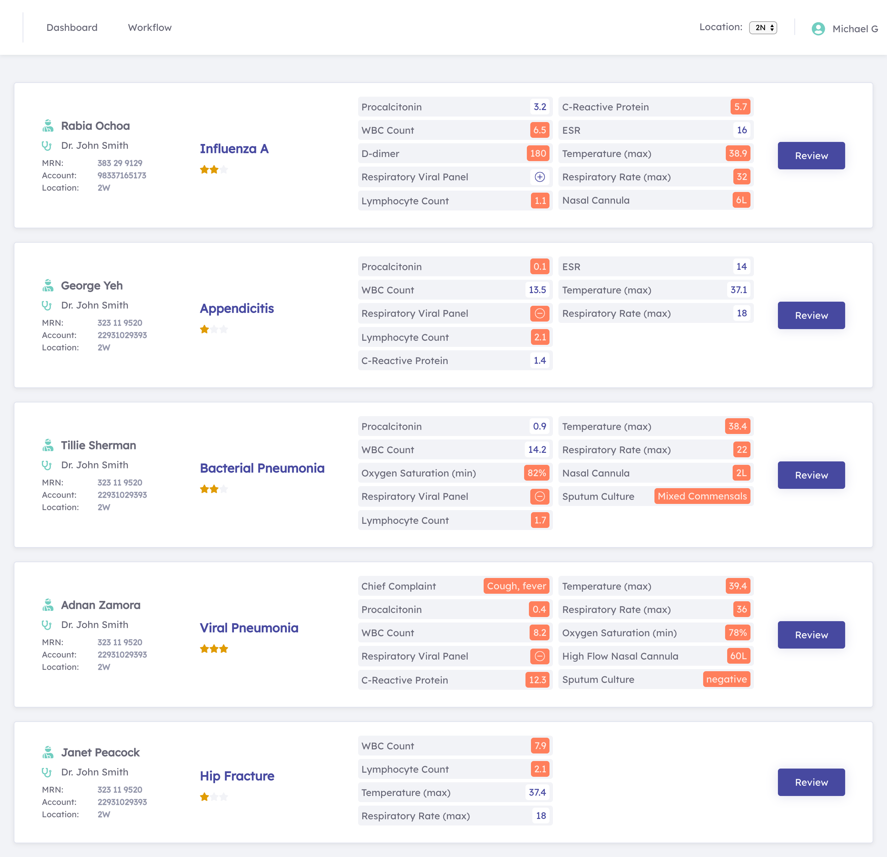
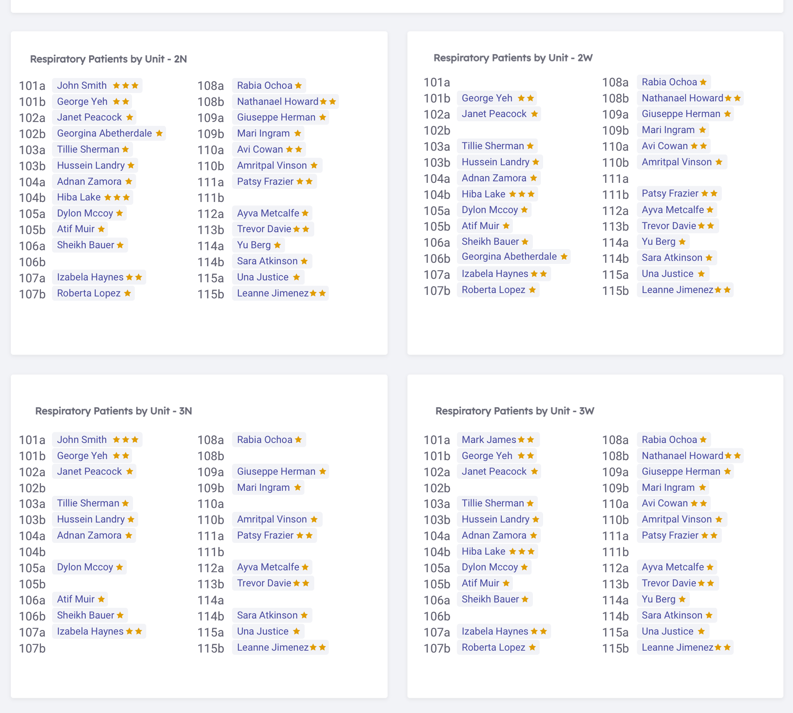

# Covid-19 Clinical Decision Support Platform
​
## Overview

__SmarterDx__ was founded by NYC physicians and data scientists. We provide operational clarity by using machine learning to catalog patient diagnoses and comorbidities directly from EMR data, allowing hospitals to build clinical pathways and submit accurate and complete claims.

The COVID pandemic will have two phases: an initial peak that overwhelms hospitals and a long right tail in which effective and systematic screening is paramount.

This tool is designed to help hospitals manage the onslaught of patients they are seeing during the initial peak, and then will help hospitals ensure systematic screening during the right tail. It helps the hospital user rapidly search hospital charts, display relevant data, and risk stratify patients.

We have provided free-to-use software which can be deployed on a hospital server and connected to a hospital's Clinical Data Warehouse. Once connected, it will show users the clinical features of patients whose data reflects high risk of having a COVID-like illness.

Please note that multiple configurations are possible depending on your hospital's needs and we are happy to share our experiences.

__We offer this free software because hospitals are making record operating and capital investments to train staff, expand ICUs, and obtain supplies__.

It will be important for hospitals to recover their revenue after this crisis. Our commercial software helps hospitals represent the full value of the care they deliver from a revenue and quality standpoint. Additional information about our CDI solution can be downloaded [here](./SmarterDx_CDI.pdf).

Our partners at [Enjoin](http://www.enjoincdi.com) have released a helpful [provider documentation tipcard](./provider_tips.pdf). Enjoin is a physician-directed clinical documentation integrity company that focuses on advanced clinical documentation practices to drive revenue integrity, compliance and translation of care.

__Please reach out to us personally at josh (at) smarterdx.com for any help with configuring the Covid-19 Clinical Decision Support Platform or if you are interested in speaking with us further.__

​
Running `docker-compose up` will build a postgres database that uses a foreign data wrapper to connect to your clinical data. It will populate Hasura relationships that are used by the frontend for keeping the data up to date. And it will build the React frontend.

This software is not meant to detect, manage or treat any diagnosis, patient or condition, but may be a useful adjunct tool for hospitals to be able to centrally review patient details, detect trends and manage resources. We make no warranty on its usefulness or accuracy.
​
## Future Development
We'd love to have community support in helping make this more useful for hospitals, either by contributing to our roadmap or be contributing your own ideas. We'd especially love to hear feedback from hospitals that implement this.
Our roadmap includes:
1. Improve installation process by pre-writing the queries for common EMRs (Epic, Cerner, Allscripts, etc).
2. Improve the covid_criteria scoring based on local results. Enable multiple criteria to be multiplactive.
    a. Consider using MIMIC-III data to evaluate our made up covid_criteria against past diagnoses of 'Viral Pneumonia'.
    b. Evaluate our hypotheses here with local data and report strengths and weakness.
3. Build hospital-level visualizations and reports to enable reviewing Units and Primary Teams. (see next figure)
4. Create decompensation model that evaluates each patient's risk of requiring additional respiratory support or death. (Will likely need more published data on what factors impact decompensation.)

### Smaller Items for Future Development
1. User management
2. Build web admin page to allow for easily updating the covid_criteria table
3. Fix Dashboard component so that it respects Current Unit filter.
4. https instructions

## License
This software is released under the open-source GNU GPL v3.0 License.
​
## Installation Instructions:
​
0. Carefully review the following schema definitions and create a sql view which matches the described format for each of them.
1. Git clone to a server running docker.
2. Follow the instructions in ./postgres/fdw_config.sql to include your database connection details and update the UNION ALL to include the names of your database views created in step 1
3. run `docker-compose up`
4. Navigate to http://localhost:3030/covid to review patients
​
## Schema Definitions
​

The frontend expects your data in the following format.
If you have questions or would like help implementing, please contact us as covid@smarterdx.com.

Table: patient - a table/view of all the patient's in the health system, 1 row per patient
Columns:
    
    id: Integer index, unique - a unique integer patient identifer, could be the patient's MRN (if an integer)
    hospital_id: Varchar(30) - an indicator for which hospital in a multi-hospital system this patient is listed in
    first_name: Varchar(100) - patient's first name
    last_name: Varchar(100) - patient's last name
    mrn: Varchar(40) - patient's medical record number, a unique patient identifier
    dob: datetime field - the patients date of birth
    sex: Varchar(1) - either 'M', 'F', or 'O' for patient's sex
    created_at: datetime field - when the patient data was first generated
    updated_at: datetime field - date time of most recent update to patient's data
​

Table: hospitalstay - a table/view of each patient encounter, ideally an ED visit that gets admitted and becomes an inpatient stay would be listed together as one encounter
Columns:

    id: Integer index, unique - a unique integer identifer for the encounter
    hospital_id: Varchar(30) - an indicator for which hospital in a multi-hospital system this patient encounter is in
    patient: reference to patient.id
    admission_date_time: datetime field - when the patient encounter starts
    discharge_date_time: datetime field - when the patient encounter ends
    account: Varchar(40) - another field option for unique encounter number
    current_location: Varchar(60) - the patient's current unit, useful for reviewing patients by location
    current_service: Varchar(60) - the patient's current provider team, useful for reviewing patients by team
    created_at: datetime field - when the encounter data was first generated
    updated_at: datetime field - date time of most recent update to encounter's data

Table: physician - a table/view of each provider (may not be physician providers, ie NP/PA etc)
Columns:

    id: Integer index, unique - a unique integer identifer for the physician
    hospital_id: Varchar(30) - an indicator for which hospital in a multi-hospital system this provider works
    first_name: Varchar(50) - the provider's first name
    last_name: Varchar(50) - the provider's last name
    degree: Varchar(20) - the provider's degree (ie MD, DO, NP, PA)
    email: Varchar(100) - the provider's email, useful for integrating a contact provider option
    phone: Varchar(20) - the provider's cell phone, useful for integrating SMS or calling functionality
    created_at: datetime field - when the provider data was first generated
    updated_at: datetime field - date time of most recent update to provider's data

Table: observation - a table/view of each data observation, likely a union of several of your data tables
Columns:

    id: Integer index, unique - a unique integer identifer for the observation
    hospital_stay: reference to hospitalstay.id
    name: Varchar(200) - the name of the observation
    date: datetime field - the date time for the observation (usually the time the data was generated, not when it was available/resulted)
    value: Varchar(100) - the resulting value
    numeric_value: Decimal field - the numeric value, if applicable

NOTES on observation
This software will expect the following data elements and it expects them to be named as follows (please contact covid@smarterdx.com if anything is unclear):

    'heart_rate'
    'systolic_blood_pressure'
    'diastolic_blood_pressure'
    'mean_blood_pressure'
    'temperature' (value should be in degrees Celcius)
    'respiratory_rate'
    'oxygen_saturation' (value should be integer followed by %, ie '98%', numeric_value should be integer)
    'oxygen_device' (value should be one of 'non_rebreather', 'high_flow_nasal_cannula', 'nasal_cannula', 'face_mask', 'NIV', 'BiPAP', 'CPAP', 'ventilator')
    'nasal_cannula_flow_rate' (value should be integer followed by L, ie '4L', numeric_value should be integer)
    'high_flow_nasal_cannula' (value should be integer followed by L for flow rate, ie '60L', numeric_value should be integer for oxygen percentage *note these are different values)
    'primary_diagnosis' (value should be a text string of the description of the admitting diagnosis, ie 'pneumonia', 'fever, unspecified', 'acute respiratory failure with hypoxia')
    'chief_complaint' (value should be a text string of the chief complaint, ideally at ED triage, ie 'Fever, cough, shortness of breath for 2 weeks')
    'treatment_team' (value should be a reference to physician.id)
    'procalcitonin'
    'wbc_count'
    'lymphocyte_count' (result should be the cell count, not the %, both are often reported)
    'd-dimer'
    'c_reactive_protein'
    'esr'
    'ferritin'
    'creatinine'
    'respiratory_viral_panel' (value should be 'negative' if all components are negative, otherwise, if one virus is positive, value should specify virus name, ie 'Influenza A', 'Enterovirus', etc)
    'sputum_culture' (value should be 'negative' if negative, should be 'mixed commensals' if mixed flora, mixed commensals, or other non-pathogenic result, if positive, value should be the name of the bacteria identified)
    'blood_culture' (value should be 'no growth to date' if negative, otherwise the bactermia name as a result, ie 'e. coli', 'pseudomonas', etc)
    'IL-6'
    'lactate'
    'troponin' (data expected is HS-troponin, numbers might need to be adjusted if your lab results another type)
    'mrsa_nasal_pcr' (value should be 'positive' or 'negative')
    'sars_cov_2' (value should be 'positive' or 'negative')
    'ck' (often called creatine kinase or creatine phosphokinase)
    'hiv' (value should be 'positive' or 'negative')

***** *please check back here frequently as additional helpful data elements may be added if they prove clinically useful*

***** *specifically, radiology results may be added shortly*

